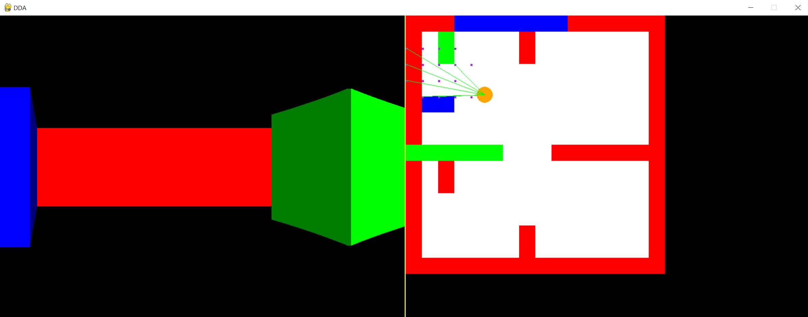

# DDA (Digital Differential Analyzer)

 a line drawing algorithm used in computer graphics to generate a line segment between two specified endpoints.
 It uses the incremental difference between the x-coordinates and y-coordinates of the two endpoints to plot the line.
 
